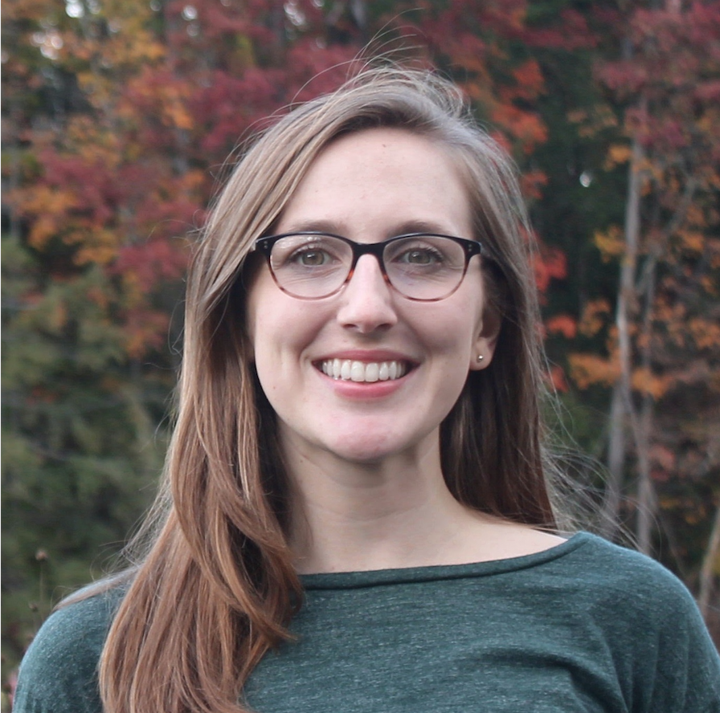

### About

<!--  -->

I am a Ph.D. candidate of Geodesy/Geophysics in [GFZ German Research Cemnter for Geosciences](https://www.gfz-potsdam.de/en/home/) and [Leibniz University Hannover](https://www.uni-hannover.de/en/). Currently I work with Prof. [Mahdi Motagh](https://www.gfz-potsdam.de/en/staff/mahdi-motagh/sec14/) in radar and optical remote sensing for analysis of geohazards group. My research interests span geodetic technique, geophysical inversions and the interpretation of geological tectonic deforamtion.  

For my Ph.D., my research focus on the post- and inter-seismic deformation associated with the 2017 Mw 7.3 Iran-Iraq border (Sarpol-e Zahab) earthquake and the Zagros orogen, combined with geodetic inversion, numerical modeling and the analysis of geological tectonics growth in this region.  

### News
<!-- this is comments -->
<table style="width:100%">
  <!--
  <tr>
    <td width="15%">Feb 2021</td>
    <td>Speaking at Microsoft's <a href="https://www.microsoft.com/en-us/research/event/aiandgaming2021/">AI & Gaming Research Summit</a> on self disclosure in online gaming communities</td>
  </tr>
  -->
  <tr>
    <td width="15%">Oct 2021</td>
    <td>Paper on <a href="https://www.sciencedirect.com/science/article/pii/S1674984721000690?via%3Dihub">focal mechanism inversion of the 2018 Mw7.1 Anchorage earthquake</a> published at <i>Geodesy and Geodynamics</i></td>
  </tr>
</table>

<!--

&copy 2021 Zelong Guo

-->

 

