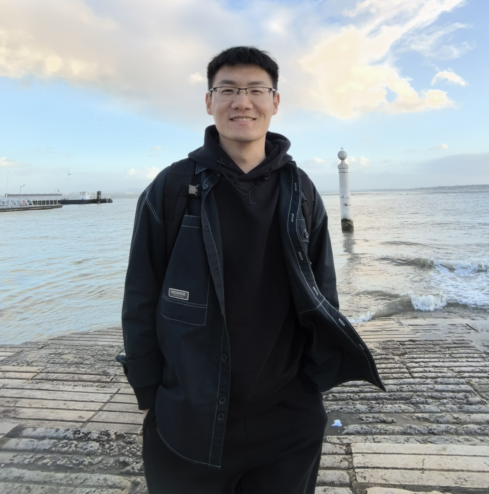

<!--  -->

<!-- this is comments -->

### About  

I am a Ph.D candidate of Geodesy/Geophysics in [GFZ German Research Center for Geosciences](https://www.gfz-potsdam.de/en/home/) and [Leibniz University Hannover](https://www.uni-hannover.de/en/). Currently I work with Prof. [Mahdi Motagh](https://www.gfz-potsdam.de/en/staff/mahdi-motagh/sec14/) in radar and optical remote sensing for analysis of geohazards group. My research interests span geodetic technique, geophysical inversions and the interpretation of geological tectonic deforamtion.  

For my Ph.D, my researches focus on postseismic modeling combined with geodetic inversion, numerical modeling and the analysis of geological tectonics growth, especially for the 2017 Mw 7.3 Iran-Iraq border earthquake.  

*Doing science with interest,  passion and curiosity, I really like the feelings after solving problems.*

### News 
<!-- this is comments -->
<!--   <td width="15%">Jun 2024</td> -->
<!-- css overflow format -->

<table style="width:100%">
  <tr>
    <td>Jun 2024</td>
    <td>&#128266; The second paper for the PhD: <a href="https://pubs.geoscienceworld.org/ssa/srl/article/doi/10.1785/0220230425/644725/Ramp-Flat-and-Splay-Faulting-Illuminated-by">Ramp‐Flat and Splay Faulting Illuminated by Frictional Afterslip Following the 2017 
 7.3 Sarpol‐e Zahab Earthquake</a>  published on <i><b>SRL!</b></i> This is a follow-up study after the my first PhD paper. </td>
  </tr>
  <tr>
    <td>Dec 2023</td>
    <td>&#128266; New paper about <a href="https://www.sciencedirect.com/science/article/pii/S0034425723004753?dgcid=coauthor">Characterization and prediction of InSAR-derived ground motion with ICA-assisted LSTM model</a>  published on <i><b>RSE!</b></i> I worked together with the first author <b>Dr. MiMi Peng</b> at GFZ, that was a very enjoyable work experience! Now she has joined Xidian University. </td>
  </tr>
  <tr>
    <td>May 2023</td>
    <td>&#128266; New paper about <a href="https://academic.oup.com/gji/advance-article/doi/10.1093/gji/ggad211/7176061"> 2015 Mw 6.5 Alor (Indonesia) earthquake </a>  published on <i><b>GJI!</b></i> The first author, <b>Dr. Guangyu Xu</b> is my senior during my master, he helped me a lot during that period! </td>
  </tr>
  <tr>
    <td>Dec 2022</td>
    <td>&#128266; New paper associated with <a href="https://agupubs.onlinelibrary.wiley.com/doi/10.1029/2022JB025148"> 2017 Mw7.3 Iran-Iraq earthquake </a>  published on <i><b>JGR:Solid Earth!</b></i> This is the first work for my PhD, trying and keeping exploring interesting things! &#128170; </td>
  </tr>
  <tr>
    <td>Oct 2021</td>
    <td> &#128266; Paper on <a href="https://www.sciencedirect.com/science/article/pii/S1674984721000690?via%3Dihub">focal mechanism inversion of the 2018 Mw7.1 Anchorage earthquake</a> published at <i>Geodesy and Geodynamics!</i></td>
  </tr>
  <tr>
    <td>Oct 2021</td>
    <td>My personal webpage is online!</td>
  </tr>
</table>

<!-- Now revolvermap only shows in the main page.-->
<!--revolvermap-->

<i>Motto: Hope to avoid repeating works that are easy, always.</i>

<i>updated: 13.10.2024</i>

