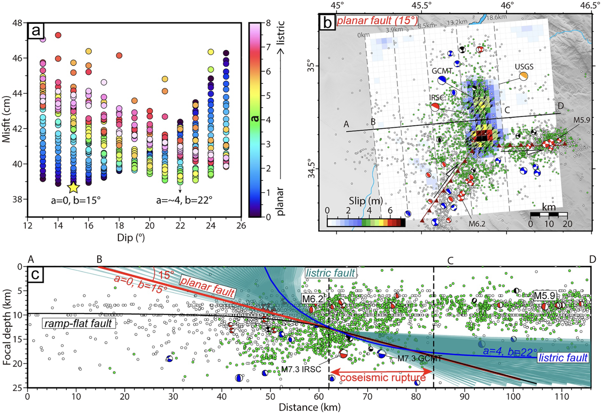
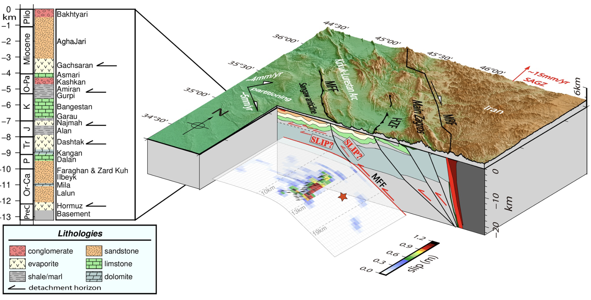

 

<!-- this is inline css gramma,it is not recommanded... Search for W3School -->
<!-- 
Coming soon ...
 -->

### Co- and Post-seismic Modeling of 2017 Iran-Iraq (Sarpol -e Zahab) Mw 7.3 Earthquake  

<b>1. Using analytical models,</b> P.S., This is the 1st work for my PhD
 
<i><b>
(Guo et al., 2020, <a href="https://agupubs.onlinelibrary.wiley.com/doi/10.1029/2022JB025148">published on JGR: Solid Earth</a>)</i></b>

Using coseismic and postseismic InSAR observations, we analyzed the fault geometry and afterslip evolution within 3 years after the mainshock.  

For coseismic modeling, we attampt to investigate whether a listric fault could better explain the coseismic deformation than a planar fault from the perspective of coseismic data fitting, because it is usual to develope listric faults in the foreland of the mountain range (Figure 1c). However, we found a simple planar fault could explain the observations well enough (Figure 1a). The coseismic rupture highlights a unilaterally southward rupture involving sequential rupture of two asperities along a dextral-thrust fault. (Figure 1b).  
   <!--  -->

   

<i>Figure 1 a). The searched fault models.  b) Slip distribution with the planar fault dipping 15°. c) Seismicity projection of Profile AD in (b) along depth. The cyan lines indicate all of the tested listric fault models.</i>

 We also modeled postseismic deformation with kinematic and stress-driven afterslip models. We found that the kinematic afterslip model can predict the spatiotemporal variations in the postseismic deformation well. A multi-segment stress-driven afterslip model which features depth-varying friction is required to better explain the evolution of postseismic deformation, compared with a two-segment stress-driven afterslip model. The transition depth inverted from kinematic afterslip and rate-strengthening afterslip models is ∼12 km, which can be best explained by the cover-basement interface (Figure 2).   

 Our results show that the viscoelastic contribution to the postseismic deformation is negligible.  

 The mismatch between the early postseismic deformation west of deformation field and stress-driven afterslip simulations can be explained either by a more complex spatial heterogeneity of frictional property of the fault rock, or by triggered slip on more complex geological structures, for example, the updip of MFF and the inherited structures, as well as the multiple detachment horizons there.

<!-- #### Coming soon ... -->

   

<i>Figure 2. 3-D block diagram showing the tectonics, fault geometry, kinematic afterslip of 3 years after the mainshock and stratigraphic column in northwestern Zagros.</i>

 
